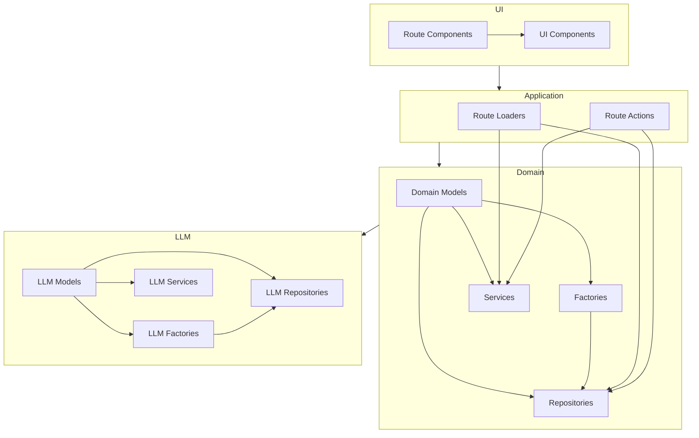
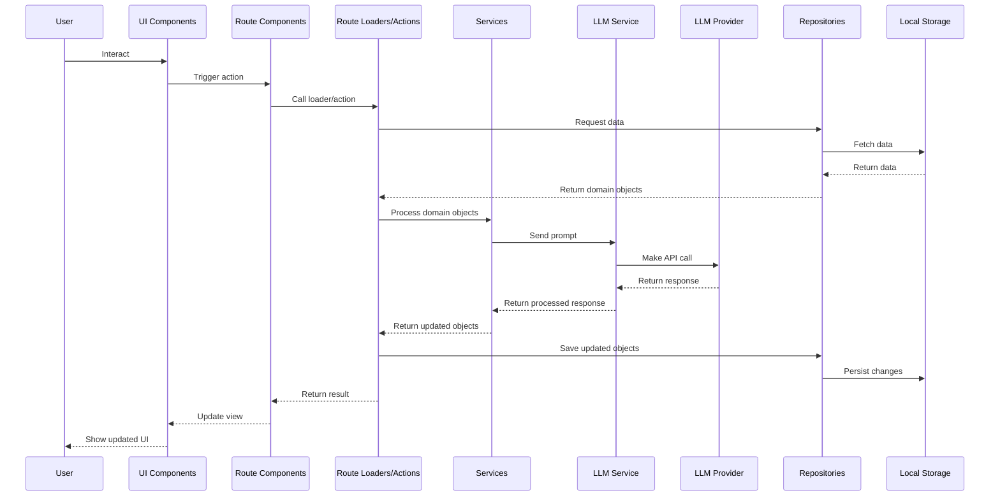

# System Patterns

## Architecture Overview

The Domain Modeler follows a Domain-Driven Design (DDD) approach with a clear separation of concerns. The application is structured as a web application with a client-side React frontend and uses local storage for persistence.

## Key Technical Decisions

1. **Domain-Driven Design**: The application itself follows DDD principles, which aligns with its purpose of helping create domain models.
2. **Client-side Architecture**: The application runs entirely in the browser, using local storage for data persistence.
3. **React Router**: Used for routing and handling the application's different views.
4. **TypeScript**: Used throughout the application for type safety.
5. **Factory Pattern**: Used for creating domain objects with proper validation and defaults.
6. **Repository Pattern**: Used for data access abstraction.
7. **Service Pattern**: Used for implementing business logic as pure functions.
8. **BYOK Strategy**: Bring Your Own Key approach for LLM integration, where users provide their own API keys.

## Design Patterns in Use

### Domain Model Pattern

The core of the application is built around domain models that represent the concepts in DDD:

- Ubiquitous Language
- Use Cases
- Entities
- Value Objects
- Aggregates
- Events
- Commands

Each domain concept is modeled as a TypeScript type with appropriate properties.

### Factory Pattern

Factory classes are used to create domain objects with proper validation and default values:

- `EntityFactory`
- `ValueObjectFactory`
- `AggregateFactory`
- `EventFactory`
- `CommandFactory`
- `UbiquitousLanguageFactory`
- `UseCaseFactory`
- `LlmConfigFactory`
- `LlmPromptFactory`

### Repository Pattern

Repository classes provide data access abstraction for each domain object:

- `EntityRepository`
- `ValueObjectRepository`
- `AggregateRepository`
- `EventRepository`
- `CommandRepository`
- `UbiquitousLanguageRepository`
- `UseCaseRepository`
- `LlmConfigRepository`

These repositories use `localforage` to persist data in the browser's local storage.

### Service Pattern

Services contain the business logic for manipulating domain objects. These are implemented as pure functions that accept domain objects as arguments and return updated copies without mutating the originals:

- `ModelExtractionService`: Extracts domain model elements from user input using LLMs
- `ModelGenerationService`: Generates domain models based on extracted information using LLMs
- `ModelRefinementService`: Refines domain models based on user feedback using LLMs
- `ExportService`: Exports domain models in various formats
- `LlmService`: Provides a facade for interacting with different LLM providers

### Facade Pattern

The `LlmService` acts as a facade that abstracts the interaction with different LLM providers. It provides a consistent interface for the application to use, regardless of the underlying LLM provider.

### Type Branding

The application uses branded types (via TypeScript's type system) to ensure type safety when dealing with domain-specific string identifiers:

- `BrandedString<"EntityId">`
- `BrandedString<"EntityName">`
- `BrandedString<"ValueObjectName">`
- etc.

## Component Relationships

## Data Flow

## LLM Integration

The application integrates with LLMs through the LLM domain, which provides:

1. **Models**: Types for LLM providers, configurations, prompts, and responses
2. **Factories**: Creation of LLM configurations and prompts with validation
3. **Repositories**: Persistence of LLM configurations in local storage
4. **Services**: Interaction with LLM providers through a consistent interface

The LLM integration follows a client-side BYOK (Bring Your Own Key) strategy, where users provide their own API keys for LLM providers. The application currently supports Anthropic as the primary provider, with placeholders for OpenAI, Google, and Mistral.

The LLM domain is used by the modeling services to:

1. Extract ubiquitous language and use cases from user input
2. Generate clarifying questions to refine understanding
3. Generate domain models based on the extracted information
4. Refine domain models based on user feedback
