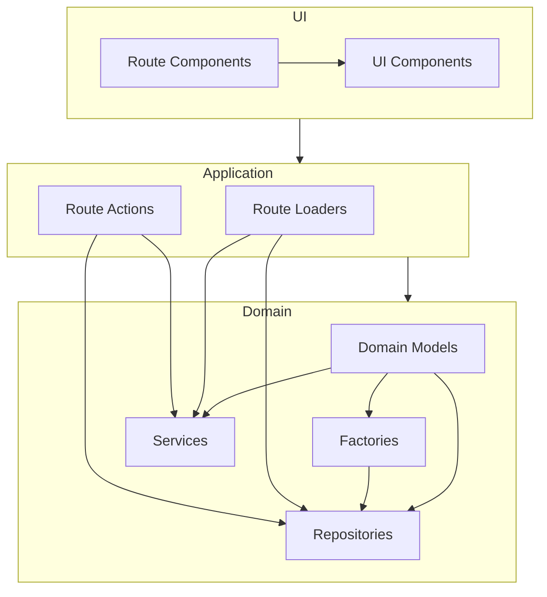
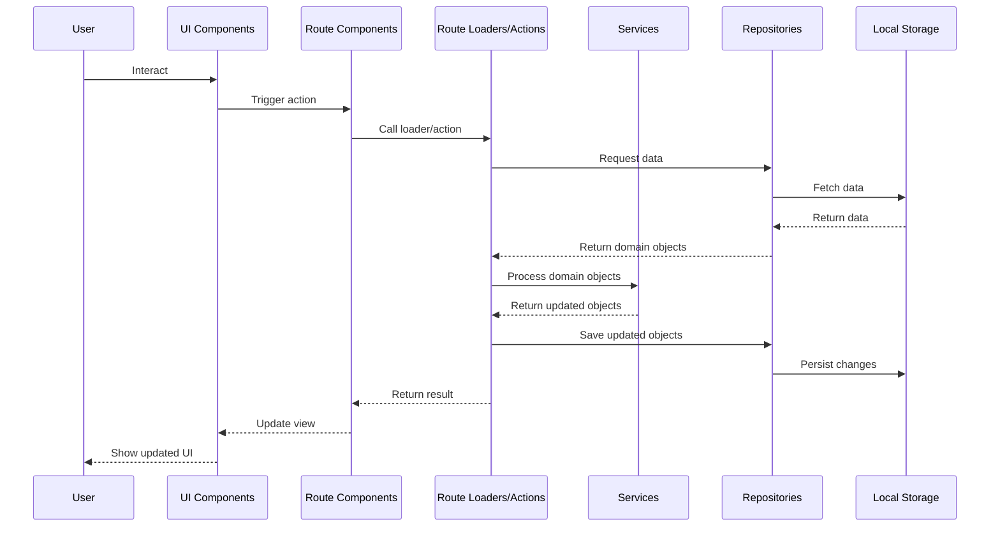

# System Patterns

## Architecture Overview

The Domain Modeler follows a Domain-Driven Design (DDD) approach with a clear separation of concerns. The application is structured as a web application with a client-side React frontend and uses local storage for persistence.

## Key Technical Decisions

1. **Domain-Driven Design**: The application itself follows DDD principles, which aligns with its purpose of helping create domain models.
2. **Client-side Architecture**: The application runs entirely in the browser, using local storage for data persistence.
3. **React Router**: Used for routing and handling the application's different views.
4. **TypeScript**: Used throughout the application for type safety.
5. **Factory Pattern**: Used for creating domain objects with proper validation and defaults.
6. **Repository Pattern**: Used for data access abstraction.

## Design Patterns in Use

### Domain Model Pattern

The core of the application is built around domain models that represent the concepts in DDD:

- Ubiquitous Language
- Use Cases
- Entities
- Value Objects
- Aggregates
- Events
- Commands

Each domain concept is modeled as a TypeScript type with appropriate properties.

### Factory Pattern

Factory classes are used to create domain objects with proper validation and default values:

- `EntityFactory`
- `ValueObjectFactory`
- `AggregateFactory`
- `EventFactory`
- `CommandFactory`
- `UbiquitousLanguageFactory`
- `UseCaseFactory`

### Repository Pattern

Repository classes provide data access abstraction for each domain object:

- `EntityRepository`
- `ValueObjectRepository`
- `AggregateRepository`
- `EventRepository`
- `CommandRepository`
- `UbiquitousLanguageRepository`
- `UseCaseRepository`

These repositories use `localforage` to persist data in the browser's local storage.

### Service Pattern

Services will contain the business logic for manipulating domain objects. These will be implemented as pure functions that accept domain objects as arguments and return updated copies without mutating the originals.

### Type Branding

The application uses branded types (via TypeScript's type system) to ensure type safety when dealing with domain-specific string identifiers:

- `BrandedString<"EntityId">`
- `BrandedString<"EntityName">`
- `BrandedString<"ValueObjectName">`
- etc.

## Component Relationships

## Data Flow

## LLM Integration

The application will integrate with LLMs to:

1. Extract ubiquitous language and use cases from user input
2. Ask clarifying questions
3. Generate domain models
4. Refine models based on user feedback

This integration will be implemented in the `llm` domain, which is currently empty but planned for future development.
